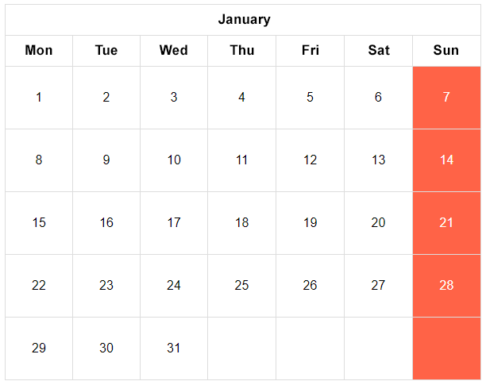

## Tic-tac-toe

> In the directory with the exercise you will find a file named `index.html`. Open it in a web browser (just click on it twice).  
> Also, open the files prepared for this exercise in a code editor of your choice (WebStorm, Visual Studio Code).

The CSS code for this exercise is already done. Try to to insert the following table into the page using HTML:

## Calendar

> In the directory with the exercise you will find a file named `index.html`. Open it in a web browser (just click on it twice).  
> Also, open the files prepared for this exercise in a code editor of your choice (WebStorm, Visual Studio Code).

The CSS code for this exercise is already done. Try to to insert the following table into the page using HTML:

